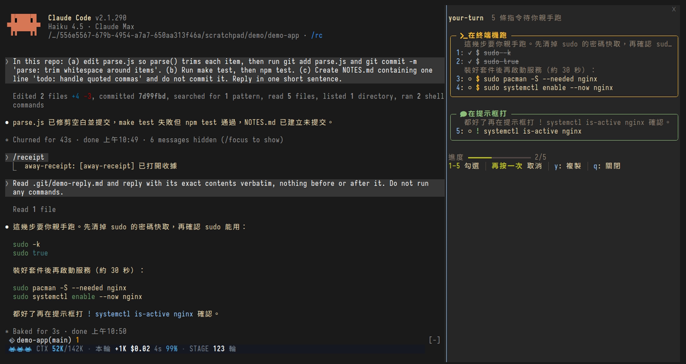
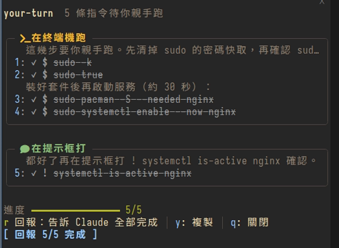
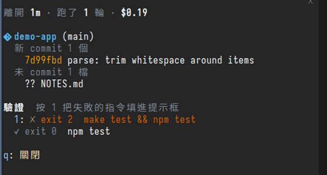

# mango-mods

**Small Claude Code mods for long, multi-repo sessions.**

A Claude Code plugin marketplace with the mods I use day to day. A mod is a
plugin written as JS/TS function hooks: it can draw a band above the prompt,
open a pane beside the conversation, and react to session events. The layout
follows the official
[claude-code-playground/claude-code/mods](https://github.com/anthropics/claude-code-playground/tree/main/claude-code/mods):
one directory per plugin.



*your-turn in a live session: Claude's reply asks you to run five commands by
hand; the pane lists them in order, grouped by where they run, with the
sentence from the reply that explains each step. Two are ticked off.*

> 繁體中文版：[README.zh-TW.md](README.zh-TW.md); each plugin's README also
> has a `README.zh-TW.md`. The mods' on-screen text is in Traditional Chinese.

| Plugin | What it does |
| --- | --- |
| [ctx-relay](ctx-relay/README.md) | Band with context size and per-turn cost. Past the handoff line it writes a handoff file, runs `/clear`, and resumes in the new conversation |
| [repo-ledger](repo-ledger/README.md) | Band listing every repo this conversation touched that still has uncommitted changes: branch, uncommitted files, unpushed commits, other worktrees, files edited this turn |
| [your-turn](your-turn/README.md) | Lists the commands you must run yourself (`sudo`, `! <cmd>`, shell blocks addressed to you) in a pane you tick off; when all are done, press `r` to tell Claude |
| [away-receipt](away-receipt/README.md) | When you come back after a while, a pane shows what happened: how long, how many turns, the cost, repos touched, tests run, background tasks |

## Screenshots

All screenshots are from a real Claude Code 2.1.290 session (Haiku 4.5) in a
throwaway repo, captured with [vhs](https://github.com/charmbracelet/vhs);
how they were made is in [docs/demo/](docs/demo/).

### ctx-relay + repo-ledger — the bands above the prompt


Top: repo-ledger — `demo-app` on `main` has 1 uncommitted file, 2 files
edited this turn. Bottom: ctx-relay — the three icons are HP left before the
handoff line, then context / handoff line, this turn's token growth, cost,
duration, cache hit rate, and one bar per turn for the context size (full
height = the handoff line).


A new conversation that finds an unclaimed handoff file shows it under the
band; press `1` to send the resume prompt.

### your-turn — all done



Every command ticked: the frames turn gray, and `r` sends "5/5 完成了"
("5/5 done") to Claude for you.

### away-receipt — what happened while you were away



One new commit, one uncommitted file, a failing `make test` (press `1` to put
it in the prompt and ask Claude to fix it) and a passing `npm test`.

## Status

- A personal experiment, tested only on Claude Code 2.1.289 and 2.1.290. The
  mods API is still in early access, so a Claude Code release may break
  these mods. No compatibility guarantee, and issues may go unanswered.
- Read the code before installing: these mods run git commands and write
  files; ctx-relay runs `/clear` on its own and sends a resume prompt in the
  new conversation.

## Install

```bash
claude plugin marketplace add mangow314/mango-mods
claude plugin install ctx-relay@mango-mods
```

For the others, replace `ctx-relay` with the directory name.

## Development

- Load the directory directly while developing, not the installed copy:
  installed plugins are cached by version.
  `claude --plugin-dir ~/projects/mango-mods/<plugin>`
- Checks, from the plugin directory: `claude plugin validate .`,
  `claude plugin test .`, `npx -p typescript@5 tsc -p .`. tsc needs the mod
  loaded once first, so the engine generates `.claude-plugin/types/` (not
  tracked).
- Release: bump `version` in the plugin's `plugin.json`, commit and push, run
  `claude plugin marketplace update mango-mods`, then update the installed
  plugin.
- Before installing any mod, read the hooks and calls that
  `claude plugin validate --json` lists.

## License

[MIT](LICENSE), covering every plugin in this repo.
