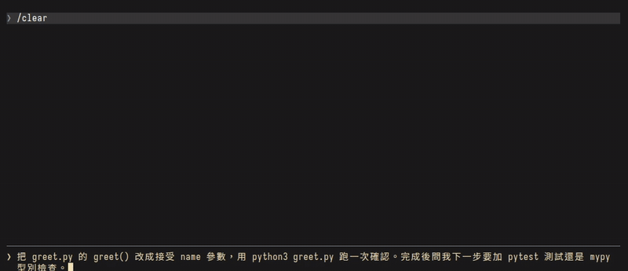
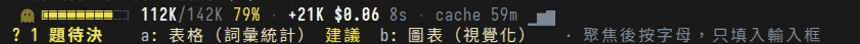

# mango-mods

**給長時間 session 用的 Claude Code mod：一眼看出回覆停在哪，context 滿之前先交接。**

這個 Claude Code marketplace 收我每天在用的 mods。mod 就是用 JS/TS function hooks 寫成的 plugin：可以在提示框上方畫一行 band、在對話旁開 pane、對 session 事件做反應。
結構和官方 [claude-code-playground/claude-code/mods](https://github.com/anthropics/claude-code-playground/tree/main/claude-code/mods) 一樣，每個 plugin 一個目錄。



> English: [README.md](README.md)。這份是它的繁體中文對譯；各 plugin 的中文說明在該目錄的 `README.zh-TW.md`。畫面標籤部分是繁體中文；模型寫的內容跟著對話語言走。

| plugin | 用途 |
|---|---|
| [sitrep](sitrep/README.md) | 每則回覆下方一個結論框：狀態、一句結論、你要做的事、可收合的段落（變更、驗證）、待你決定的題目；提示框上方一行待決列可用鍵盤選答。你跳過沒答的題目，下一輪會再列出來 |
| [ctx-relay](ctx-relay/README.md) | band 顯示 context 大小、每輪花費和 prompt cache 倒數；越過交接線時自動寫交接檔、/clear、在新對話接續。不需要其他 skill 或 hook |

## sitrep



*Claude 改檔、跑一次，然後問一題。結論框把「變更」「驗證」各收成一行；`Ctrl+X Tab` 聚焦提示框上方那列，按 `a` 把答案填進提示框（不會送出）。*

mod 在系統提示裡請模型在回覆末尾附一個小小的 ` ```ui-summary ` 區塊，畫面上把它藏起來，改畫成結論框。細節見 [sitrep/README.zh-TW.md](sitrep/README.zh-TW.md)。

## ctx-relay



進度條往交接線填滿，越接近越變色（這裡 79%，黃色）；prompt cache 還熱時，掃光會在進度條上跑。右邊是本輪增量、花費，和 cache 還熱多久。下面一行是 sitrep 的待決列。


新對話開場時，如果有還沒人接手的交接檔，band 下面多一行；按 `1` 送出接續指令。交接檔預設四欄（Goal、Files、Verified、Next），見 [ctx-relay/README.zh-TW.md](ctx-relay/README.zh-TW.md)。

截圖都來自一次性測試 repo 裡的真實 Claude Code session，做法見 [docs/demo/](docs/demo/)。

## 狀態
- 個人實驗，在 Claude Code 2.1.289 到 2.1.295 測過。mods API 還在 early access，Claude Code 改版後可能要跟著改；不保證相容，也不保證回 issue。
- 裝之前請先讀程式碼：這些 mod 會跑 git 指令、寫檔；sitrep 會在系統提示加一段；ctx-relay 會自動 /clear，並在新對話送出接續訊息。

## 安裝
```
claude plugin marketplace add mangow314/mango-mods
claude plugin install sitrep@mango-mods
claude plugin install ctx-relay@mango-mods
```

## 已下架

repo-ledger、your-turn、away-receipt 已在 2026-10-10 移除，最後一版留在 git tag `archive/mods-before-cleanup`。

## 開發與發布
- 開發時直接載入目錄，不要用已安裝的副本，因為已安裝的 plugin 會按版本快取：
  `claude --plugin-dir ~/projects/mango-mods/<plugin>`
- 檢查：在 plugin 目錄裡跑 `claude plugin validate .`、`claude plugin test .`、`npx -p typescript@5 tsc -p .`。
  tsc 需要先載入一次 mod，引擎才會產生 `.claude-plugin/types/`，這個目錄不進版控。
- 發布：先調高該 plugin `plugin.json` 的 `version`，然後 commit、push，再跑 `claude plugin marketplace update mango-mods`，最後更新已安裝的版本。
- 安裝任何 mod 前，先看 `claude plugin validate --json` 列出的 hooks 和 calls 清單。

## 授權
[MIT](LICENSE)，涵蓋這個 repo 裡所有 plugin。
