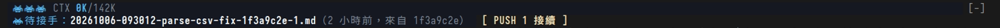

# ctx-relay

> 繁體中文版：[README.zh-TW.md](README.zh-TW.md). The band and commands are in
> English. Handoff files use English headings with the body in the
> conversation's language; the optional `full` format is in Traditional
> Chinese (see "Handoff file format").

It needs no other skill or hook: the mod writes the handoff file itself.

A Claude Code mod that draws a band above the prompt: current context / the
handoff line, this turn's cost, and how long the prompt cache stays warm.
When the main conversation crosses the automatic handoff line, it hands off on
its own: it writes a handoff file, runs `/clear`, and resumes in the new
conversation.
When a new conversation starts and there is a handoff file nobody has picked
up, the band gets a second line, Pending handoff; press 1 to send the resume
prompt.

Tested on: Claude Code 2.1.289 (0.5.0, loaded with `--plugin-dir`; tested the
countdown, cancelling by button, cancelling by typing, a full automatic
handoff, and running alongside blast-radius), and 2.1.294 (the current band
and the cache countdown). The mods API is still in early access, so a Claude
Code release may require changes.

## What it does

| When | What happens |
| --- | --- |
| The main conversation stops (Stop) with context ≥ the handoff line | If Claude Code reports background work (shells, subagents, monitors, workflows, …) or a one-shot scheduled task, the handoff is deferred and the band shows why; recurring schedules do not block it. Otherwise a 60-second countdown starts |
| While deferred, context reaches the cap (halfway between the handoff line and the compaction point) | The countdown runs anyway; the handoff file header lists the work still running (its completion notice may never arrive) |
| Another Stop hook blocks the stop (the turn has not really ended) | No decision; wait for the stop that really ends the turn |
| During the countdown | Press Cancel (hotkey 1) to cancel; for the rest of this conversation it only reminds you. Sending any message only postpones it: if you are still past the line when that turn ends, the countdown starts again |
| A new turn starts during the countdown or preparation (a schedule, a background notification, a message from another session) | This switch is dropped; it decides again when the turn ends |
| The countdown ends | The mod collects git state → `$.model.fork` fills in only the body of each field, one `=== KEY ===` line per field (gives up after 3 minutes without an answer) → the mod assembles the handoff file under its own hard-coded `## ` headings, so the model has no chance to mistype a heading → machine check (a missing field is marked `thin:`; no section marker at all counts as a failure) → write the file and read it back → confirm the conversation has not changed → `/clear` → send the handoff file path and the pickup rules in the new conversation |
| Any step fails before `/clear` | Stays in the original conversation, the band shows why, no retry |

In the `full` format, the mod appends the coordination contract verbatim, without the model: a
`=== CONTRACT ===` section written by the fork, and any `## 協調契約`
("coordination contract") section in its body, are always dropped. Any other
`## ` line in the fork's body is demoted to `### `, so the only second-level
headings in a handoff file are the mod's own. A section whose key is mistyped
(for example `=== VERIFED ===`): that field is marked `thin:`, and its body is
kept, appended at the end of Next (`full`: 關鍵細節備忘, "key details") with a note. A
` ```ui-summary ` block in the fork's output (the summary the sitrep mod asks
the model to append to each reply) is removed.

## Thresholds

- Compaction point: the auto-compact trigger Claude Code reports itself
  (`autoCompactThreshold` from `$.session.usage({ breakdown })`). With
  auto-compact off, the model's context window is used instead.
- Handoff line: the `handoffTokens` setting if set; if not (0), 85% of the
  compaction point. A setting above 85% of the compaction point (for example
  after switching to a 200K model) falls back to 85%, and
  `/ctx-relay-status` says so.
- Orange warning line: 88% of the handoff line.
- Deferral cap: with background work, the handoff can be deferred at most to
  halfway between the handoff line and the compaction point.

Set the handoff line from the ctx-relay row in `/config`, or from a shell:

```bash
echo '{"handoffTokens": "400000"}' | claude plugin configure ctx-relay@mango-mods --values-stdin
```

A setting changed from the shell takes effect after restarting Claude Code or
running `/reload-plugins` in the session. For end-to-end tests you can set it
very low (for example 1).

Note: with `CLAUDE_AUTOCOMPACT_PCT_OVERRIDE` set, the compaction point Claude
Code reports may not apply that percentage. Measured on 2.1.288: with
`CLAUDE_CODE_AUTO_COMPACT_WINDOW=600000` and
`CLAUDE_AUTOCOMPACT_PCT_OVERRIDE=88`, it reported 567,000 (=600,000−33,000).
Measured on 2.1.289 with a 120,000 window: it reported 87,000, and compaction
happened on the turn where context grew from 86,412 to 88,335; both the
reported value and (120,000−20,000)×88% = 88,000 fall in that range, so it is
impossible to tell which is right. With a 600K window the real compaction point
may still be 510K, 528K, or 567K. If you use this environment variable, set
`handoffTokens`.

When loaded with `claude --plugin-dir`, the installed copy's `handoffTokens`
is not read, so the handoff line is the automatic value.

## The band


One line, left to right:

1. An icon and a 10-cell capsule progress bar, both colored by how close
   context is to the handoff line (tokens ÷ handoff line):

   | Tokens ÷ handoff line | Icon | Color |
   | --- | --- | --- |
   | below 70% | space invader | green |
   | 70% up to the warning line | ghost | yellow |
   | warning line up to the handoff line | skull | orange |
   | at or past the handoff line | skull | vermilion |

   The bar moves: every 250 ms a highlight steps right across the filled part,
   and the icon pulses. Once the prompt cache has expired (you are probably
   away), the animation stops; it starts again when the next turn ends.
2. `220K/434K 51%`: current context / handoff line, and the share.
3. `· +20K $0.50 12s`: how much context this turn added, what it cost, and how
   long it took. When this turn's cache hit rate (summed over every request in
   the turn) is below 40%, `󰜗 12%` follows: the turn ran on a cold cache and
   cost more, usually because the cache expired while you were idle.
4. `· cache 42m`: the prompt cache countdown; see "Cache countdown". Hidden
   while a turn runs.
5. Bars: context at the end of each recent turn, a full bar = at the handoff
   line. Only when the terminal is at least 110 columns wide.
6. `· <status>`: handoff deferred (with the reason), writing the handoff file,
   failed, cancelled, or which file this conversation resumed from.

- Foreground colors only; no backgrounds.
- Below 80 columns the progress bar is dropped (the icon and numbers stay);
  whatever still does not fit is cut at the end.
- During the countdown the whole line becomes
  `󰚌 Handoff in 42s · at 400K · send a message to postpone`, with a
  `Cancel [1]` button next to it.
- After a handoff (automatic, or `Resume [1]` on a pending one) the status
  reads `Resumed from <file> · next: <first line of the next-step field> ·
  /ctx-relay-notes`, and an automatic handoff also shows a toast. The "next"
  part goes away as soon as you type.
- If `/clear` succeeded but the resume message could not be sent, the line
  reads `Cleared, but <reason>. Type: Read <path> and continue from it`. The
  part after "Type:" is what you paste into the conversation; with the `full`
  format it is in Chinese (`讀 <path> 並依其接續`).
- When another mod also draws a band (for example blast-radius, which draws
  Proceed / Cancel here in a narrow terminal), its content goes on top and the
  ctx-relay line below. When there is not enough height, or the other mod does
  not give way, the ctx-relay line can be hidden; see "Known limits".
- The icons, the snowflake, and the capsule (U+EE00–EE05, in Nerd Fonts 3.0
  and later) need a Nerd Font, for example Symbols Nerd Font as a fallback;
  without one they render as boxes.
- Inside tmux, Claude Code uses only 256 colors by default. If tmux has RGB
  enabled, set `CLAUDE_CODE_TMUX_TRUECOLOR=1` to get the exact colors.

## Cache countdown

The prompt cache lets the next request re-read the conversation cheaply. It
expires after a stretch with no requests (its time to live, TTL), and every
request restarts the clock. The countdown tells you how long it has left, so
you can decide whether to keep going, compact first, or start a new session.

- Time left = TTL − (now − when the last main-conversation turn ended). Shown
  in minutes, in seconds under one minute, orange in the last 5 minutes, and
  `󰜗 cold` once expired (the last turn's hit rate is hidden then).
- Mods do not receive Claude Code's own cache state (`prompt_cache` is only
  in the status line's input), so ctx-relay works it out itself. It measures
  from the end of the turn, which is later than the start of the turn's last
  request, so it can run long by about the length of the last reply. Treat it
  as a guide.
- TTL, first match wins, in the order Claude Code uses
  ([prompt caching](https://code.claude.com/docs/en/prompt-caching)):
  1. `FORCE_PROMPT_CACHING_5M` set → 5 minutes
  2. `CLAUDE_CODE_PROMPT_CACHE_TTL` (`5m` or `1h`)
  3. the `promptCacheTtl` setting (`5m` or `1h`)
  4. `ENABLE_PROMPT_CACHING_1H` set → 1 hour
  5. a Claude subscription (the session reports rate limits) → 1 hour;
     otherwise (API key, cloud provider) → 5 minutes
- Correction from what it sees: if you come back after more than 5 minutes
  but before the assumed TTL, and that turn's hit rate is below 40%,
  ctx-relay switches this session to 5 minutes (for example, a subscription
  that went over its included usage drops to 5 minutes). `/ctx-relay-status`
  shows why.
- After the main conversation is compacted (`/compact`, auto-compact, or idle
  compaction), the old cache no longer matches the start of the conversation,
  so the countdown is dropped until the next turn ends.
- Idle compaction: Claude Code can compact a long conversation by itself while
  you are idle, before the cache expires, and then shows "Compacted while idle,
  before the prompt cache expired". This is not in the docs; read from the
  2.1.294 executable: it runs only when the cache is a one-hour one and still
  warm, context is at least 200K (`CLAUDE_CODE_IDLE_COMPACT_MIN_TOKENS`, no
  lower than 100K), you have been idle for about 90% of the TTL (about 54
  minutes), and Anthropic has turned the feature on for your account. Turn it
  off with `"idleCompaction": false` in settings. It shrinks the context, so
  the handoff line is not reached.
- ctx-relay does not keep the cache warm. A request sent with `$.model.fork`
  does not read the main conversation's cache (see "Known limits"), so it
  cannot extend it.

## Handoff file format

The `handoffFormat` setting picks one of two formats:

| Format | Fields | Language |
| --- | --- | --- |
| `lite` (default) | Goal, Files, Verified, Next | English headings and instructions; the fork writes the body in the conversation's language |
| `full` | The 8 fields of the author's own handoff skill (goal + latest instruction, files, verified vs gaps, unrelated dirty files, next step, key details, hard constraints as YAML, pointers), plus the source handoff file's coordination contract and the session's progress `INDEX.md` | Traditional Chinese |

`full` follows conventions from the author's own setup; most people want
`lite`. The notes pane and the pickup line read either format, whatever the
setting says.

```bash
echo '{"handoffFormat": "full"}' | claude plugin configure ctx-relay@mango-mods --values-stdin
```

## Where handoff files go

In a git repo: `<git-common-dir>/harness/handoff/`; outside git:
`~/.claude/harness/<directory name>-<first 8 chars of sha256>/handoff/`.
File name: `<timestamp>-<slug>-<first 8 chars of the source session id>-<batch number>.md`,
so two batches in the same second, or two sessions sharing one
git-common-dir, never overwrite each other.
In the `full` format, if `<same root>/progress/<session id>/INDEX.md` exists,
it is passed to the fork as well.

## Waiting to be picked up (handoff-pickup)



The line reads `󰯉 Pending handoff: <file name> (2h ago, from 1f3a9c2e)`,
with a `Resume [1]` button. When more handoff files are waiting, a `+N`
follows.

| When | What happens |
| --- | --- |
| A new conversation starts (no messages yet at startup; an old conversation reopened with `--resume` does not count), or after you run `/clear` yourself | Look for handoff files in the handoff folder that nobody has picked up, and show the newest; the count of the others goes in `+N` |
| Press 1 while the prompt is empty (or click the button) | Sends "Read <full path> and continue from it; check the git state and the next step before acting." (the Chinese version of that sentence for a `full` file), and marks this file as picked up |
| The main conversation starts a new turn (you send a message, press resume, a schedule fires) | The line goes away |

- "Picked up" is recorded as `<handoff folder>/.picked/<handoff file name>`
  (an empty file); the handoff file itself is not touched. Because the folder
  name starts with a dot, the handoff skill's `ls -t` for the newest handoff
  file does not see it.
- A file is marked as picked up in three cases: you press resume; a message you
  send contains the full path of a handoff file (you pasted a resume prompt by
  hand); ctx-relay hands off automatically (marked before `/clear`, so the new
  conversation does not list it).
- On first enable, ctx-relay stores the current time in its own store
  (`pickupSince`): handoff files modified before that count as picked up, so a
  fresh install does not list a pile of old files.
- "How long ago" uses the file's modification time; "from" is the first 8
  characters of the first `session \`<id>\`` in the handoff file, and is
  omitted if not found.
- The message sent by pressing 1 is labeled as coming from ctx-relay (the mod
  sends it for you; the model sees the original text).
- While the pickup line is shown, typing "1" into an empty prompt presses
  resume instead of typing. The countdown's cancel button is also 1, but the
  countdown only appears after a turn ends, when the pickup line is already
  gone, so the two never appear together.
- If sending the resume prompt is blocked (for example by a hook in settings),
  the line stays and the file is not marked as picked up.

## Commands

- `/ctx-relay-status`: shows thresholds, readings, handoff state, background
  work, the cache TTL (with where it came from) and time left, and the last
  three handoff failures. Every failed handoff (before `/clear`) is appended
  to `<harness root>/ctx-relay/failures.jsonl` (time, auto or manual, tokens,
  minutes since you last typed, reason; last 100 kept).
- `/ctx-relay-notes`: opens (or, typed again, closes) a notes pane for
  checking where things stood: the handoff file this conversation resumed
  from (or the newest one in `handoff/`), plus the phase from the `INDEX.md`
  of the session named in its header. After an automatic handoff it opens by
  itself once, without taking the prompt's focus, when the terminal is wide
  enough; otherwise the toast points to the command. Two pages: `s` status
  (next steps, don'ts, gaps, then goal, phase and files) and `v` evidence
  (the verified notes as written, and where the handoff came from). One
  accent color and gray text; red, yellow and green mark only the ✓ ▲ ✗
  symbols. Long lines wrap. The pane paints its own dark background, so it
  reads the same over a transparent terminal. `q` closes it.
- `/ctx-relay-now`: hand off right away; with background work running, type
  `/ctx-relay-now yes`. The fork instructions, the handoff file header, and the
  resume message in the new conversation all say this was a manual
  `/ctx-relay-now` handoff, not "crossed the automatic handoff line".
  - You can append your latest instruction, for example `/ctx-relay-now yes`,
    a newline, then "do B and install the new mod". Only a first word of `yes`
    counts as confirmation; the rest is the instruction. Without background
    work, `yes` is not needed and all the arguments are the instruction.
  - The instruction is passed verbatim to the fork for writing the "goal +
    latest instruction" and "next step" fields, and written verbatim into the
    handoff file header and the resume message (each line prefixed with `> `,
    so a `## ` in the instruction never becomes a handoff file heading).
  - With an instruction attached, the resume message tells the new
    conversation to check git state and then follow the instruction, without
    waiting for you to repeat it. Without one, as before: report the current
    state and wait for you.
  - Exception (`full` only): when the handoff file is missing 硬約束 ("hard constraints";
    the header's `thin` lists 硬約束), the task's constraints may not have been
    written down, so the resume message instead asks the new conversation to
    first report how it plans to follow the instruction and wait for your
    confirmation.

## Known limits

- Background work never times out: a long-running server defers the handoff
  until the cap forces a countdown; to hand off earlier, use
  `/ctx-relay-now yes`.
- The background work the commands see is the list from the last time the
  main conversation stopped, plus the subagents running right now.
- A subagent may appear in both Claude Code's background-work list and its
  subagent list, so the count in the deferral reason can be too high.
- Tasks sent through agent-bridge and not yet answered are not detected:
  check them yourself before `/clear`.
- With blast-radius, when the terminal is narrow enough that it draws its
  interception box where the band goes (it does at 80 columns; at 200 columns
  it uses a side pane and is unaffected), the ctx-relay line may be hidden
  during the interception. The buttons still work, and the band comes back
  when the interception ends.
  - The terminal needs at least 42 rows to fit both (measured on 2.1.289,
    with 2 files listed in the box, 11 rows in total: at 41 rows or fewer it
    shows "↓ 2 more"). The more files the box lists, the more rows it needs.
  - When blast-radius draws first, it does not pass the slot on to the next
    mod, so no height is enough. Which mod draws first depends on load order,
    which the official docs do not specify.
- Writing the handoff file costs about as much as one turn on a cold cache.
  The fork does not read the main conversation's cache: measured on 2.1.294,
  a fork sent 30 seconds after a turn hit 43% (only the shared system prompt
  and tools), while the main conversation's next turn hit 100%.
- After a compaction, the band's token count is still the reading from before
  it until the next turn ends.
- The handoff content comes from the fork; the machine check only looks for
  empty fields and does not guarantee the content is correct. The new
  conversation is asked to check against git first.
- After `/clear`, `$.state` is reset; module variables and timers survive
  (measured), so the mod cancels its timers before clearing.
- Needs `bash` and `git` on PATH; outside git, also `realpath` (GNU, with
  `-m`) and `sha256sum` or `shasum`.
- The handoff path algorithm is copied from mango's dotfiles
  `hooks/_lib/harness-paths.sh`, so both put handoff files in the same place;
  change one, change the other.
