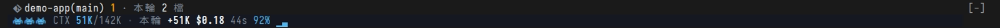

# ctx-relay

> 繁體中文版：[README.zh-TW.md](README.zh-TW.md). The mod's on-screen text and
> the handoff files it writes are in Traditional Chinese.

A Claude Code mod that draws a band above the prompt: current context / the
handoff line, and this turn's cost.
When the main conversation crosses the automatic handoff line, it hands off on
its own: it writes a handoff file, runs `/clear`, and resumes in the new
conversation.
When a new conversation starts and there is a handoff file nobody has picked
up, the band gets a second line, 待接手 ("waiting to be picked up"); press 1 to
send the resume prompt.

Tested on: Claude Code 2.1.289 (0.5.0, loaded with `--plugin-dir`; tested the
countdown, cancelling by button, cancelling by typing, a full automatic
handoff, and running alongside blast-radius). The mods API is still in early
access, so a Claude Code release may require changes.

## What it does

| When | What happens |
| --- | --- |
| The main conversation stops (Stop) with context ≥ the handoff line | If Claude Code reports background work (shells, subagents, monitors, workflows, …) or a one-shot scheduled task, the handoff is deferred and the band shows why; recurring schedules do not block it. Otherwise a 60-second countdown starts |
| While deferred, context reaches the cap (halfway between the handoff line and the compaction point) | The countdown runs anyway; the handoff file header lists the work still running (its completion notice may never arrive) |
| Another Stop hook blocks the stop (the turn has not really ended) | No decision; wait for the stop that really ends the turn |
| During the countdown | Press 取消自動交接 ("cancel automatic handoff", hotkey 1) to cancel; for the rest of this conversation it only reminds you. Sending any message only postpones it: if you are still past the line when that turn ends, the countdown starts again |
| A new turn starts during the countdown or preparation (a schedule, a background notification, a message from another session) | This switch is dropped; it decides again when the turn ends |
| The countdown ends | The mod collects git state and the progress INDEX → `$.model.fork` fills in only the body of the handoff skill's 8 fields, one `=== KEY ===` line per field (GOAL / FILES / VERIFIED / DIRTY / NEXT / NOTES / CONSTRAINTS / POINTERS) (gives up after 3 minutes without an answer) → the mod assembles the handoff file under 8 hard-coded Chinese `## ` headings, so the model has no chance to mistype a heading → machine check (a missing field is marked `thin:`; no section marker at all counts as a failure) → the source handoff file's coordination contract is appended verbatim → write the file and read it back → confirm the conversation has not changed → `/clear` → send the handoff file path and the pickup rules in the new conversation |
| Any step fails before `/clear` | Stays in the original conversation, the band shows why, no retry |

The mod appends the coordination contract verbatim, without the model: a
`=== CONTRACT ===` section written by the fork, and any `## 協調契約`
("coordination contract") section in its body, are always dropped. Any other
`## ` line in the fork's body is demoted to `### `, so the only second-level
headings in a handoff file are the mod's own. A section whose key is mistyped
(for example `=== VERIFED ===`): that field is marked `thin:`, and its body is
kept, appended at the end of 關鍵細節備忘 ("key details") with a note. A
` ```ui-summary ` block in the fork's output (the summary the sitrep mod asks
the model to append to each reply) is removed.

## Thresholds

- Compaction point: the auto-compact trigger Claude Code reports itself
  (`autoCompactThreshold` from `$.session.usage({ breakdown })`). With
  auto-compact off, the model's context window is used instead.
- Handoff line: the `handoffTokens` setting if set; if not (0), 85% of the
  compaction point. A setting above 85% of the compaction point (for example
  after switching to a 200K model) falls back to 85%, and
  `/ctx-relay-status` says so.
- Orange warning line: 88% of the handoff line.
- Deferral cap: with background work, the handoff can be deferred at most to
  halfway between the handoff line and the compaction point.

Set the handoff line from the ctx-relay row in `/config`, or from a shell:

```bash
echo '{"handoffTokens": "400000"}' | claude plugin configure ctx-relay@mango-mods --values-stdin
```

A setting changed from the shell takes effect after restarting Claude Code or
running `/reload-plugins` in the session. For end-to-end tests you can set it
very low (for example 1).

Note: with `CLAUDE_AUTOCOMPACT_PCT_OVERRIDE` set, the compaction point Claude
Code reports may not apply that percentage. Measured on 2.1.288: with
`CLAUDE_CODE_AUTO_COMPACT_WINDOW=600000` and
`CLAUDE_AUTOCOMPACT_PCT_OVERRIDE=88`, it reported 567,000 (=600,000−33,000).
Measured on 2.1.289 with a 120,000 window: it reported 87,000, and compaction
happened on the turn where context grew from 86,412 to 88,335; both the
reported value and (120,000−20,000)×88% = 88,000 fall in that range, so it is
impossible to tell which is right. With a 600K window the real compaction point
may still be 510K, 528K, or 567K. If you use this environment variable, set
`handoffTokens`.

When loaded with `claude --plugin-dir`, the installed copy's `handoffTokens`
is not read, so the handoff line is the automatic value.

## The band



A live Claude Code 2.1.290 session. The bottom line is ctx-relay (the top line
is repo-ledger): `CTX 51K/142K · 本輪 +51K $0.18 44s 92%` (本輪 = "this
turn"), followed by the bars.

Styled like an 8-bit arcade scoreboard. During the countdown the whole line
becomes "CONTINUE? 42s（400K 存檔交接／發訊息延到下輪）" ("handing off at 400K;
a message postpones it to the next turn"), with a cancel button next to it (press 1).

- The three little monsters are your HP before the handoff line (tokens ÷
  handoff line): below 40%, three monsters; below 70%, one turns into a ghost;
  up to the warning line, one monster and two ghosts; past the warning line,
  skulls; past the handoff line, all skulls.
- Colors: sky blue = normal, orange = past the warning line, vermillion = past
  the handoff line / counting down / failed. The background follows the three
  states: dark blue / dark orange / dark red.
- `220K/400K`: current context / handoff line. `90%`: this turn's cache hit
  rate (summed over every request in the turn), with an icon for how warm it
  is: ≥80% fire (hot), 40–79% thermometer, <40% snowflake (cold — usually the
  cache expired while idle, so this turn cost more). The share of the model window
  and the elapsed time are not on the band; see your status line.
- The bars appear only when the terminal is at least 110 columns wide; their
  height is relative to the handoff line, and a full bar = at the handoff line.
- When another mod also draws a band (for example blast-radius, which draws
  Proceed / Cancel here in a narrow terminal), its content goes on top and the
  ctx-relay line below. When there is not enough height, or the other mod does
  not give way, the ctx-relay line can be hidden; see "Known limits".
- The icons need a Nerd Font (for example Symbols Nerd Font as a fallback);
  without one the three monsters render as boxes.
- Inside tmux, Claude Code uses only 256 colors by default, so the dark
  backgrounds turn into much brighter colors such as #00005f. If tmux has RGB
  enabled, set `CLAUDE_CODE_TMUX_TRUECOLOR=1` to get the original colors.

## Where handoff files go

In a git repo: `<git-common-dir>/harness/handoff/`; outside git:
`~/.claude/harness/<directory name>-<first 8 chars of sha256>/handoff/`.
File name: `<timestamp>-<slug>-<first 8 chars of the source session id>-<batch number>.md`,
so two batches in the same second, or two sessions sharing one
git-common-dir, never overwrite each other.
If `<same root>/progress/<session id>/INDEX.md` exists, it is passed to the
fork as well.

## Waiting to be picked up (handoff-pickup)


The line reads: 待接手 ("waiting to be picked up"), the file name, (2 小時前，來自
1f3a9c2e = "2 hours ago, from 1f3a9c2e"), and the button `PUSH 1 接續`
("resume"). When more handoff files are waiting, a `+N` follows the file name.

| When | What happens |
| --- | --- |
| A new conversation starts (no messages yet at startup; an old conversation reopened with `--resume` does not count), or after you run `/clear` yourself | Look for handoff files in the handoff folder that nobody has picked up, and show the newest; the count of the others goes in `+N` |
| Press 1 while the prompt is empty (or click the button) | Sends "讀 <full path> 並依其接續執行；先確認 git 狀態與下一步再動手。" ("Read <full path> and continue from it; check git state and the next step before acting."), and marks this file as picked up |
| The main conversation starts a new turn (you send a message, press resume, a schedule fires) | The line goes away |

- "Picked up" is recorded as `<handoff folder>/.picked/<handoff file name>`
  (an empty file); the handoff file itself is not touched. Because the folder
  name starts with a dot, the handoff skill's `ls -t` for the newest handoff
  file does not see it.
- A file is marked as picked up in three cases: you press resume; a message you
  send contains the full path of a handoff file (you pasted a resume prompt by
  hand); ctx-relay hands off automatically (marked before `/clear`, so the new
  conversation does not list it).
- On first enable, ctx-relay stores the current time in its own store
  (`pickupSince`): handoff files modified before that count as picked up, so a
  fresh install does not list a pile of old files.
- "How long ago" uses the file's modification time; "from" is the first 8
  characters of the first `session \`<id>\`` in the handoff file, and is
  omitted if not found.
- The message sent by pressing 1 is labeled as coming from ctx-relay (the mod
  sends it for you; the model sees the original text).
- While the pickup line is shown, typing "1" into an empty prompt presses
  resume instead of typing. The countdown's cancel button is also 1, but the
  countdown only appears after a turn ends, when the pickup line is already
  gone, so the two never appear together.
- If sending the resume prompt is blocked (for example by a hook in settings),
  the line stays and the file is not marked as picked up.

## Commands

- `/ctx-relay-status`: shows thresholds, readings, handoff state, and
  background work.
- `/ctx-relay-now`: hand off right away; with background work running, type
  `/ctx-relay-now yes`. The fork instructions, the handoff file header, and the
  resume message in the new conversation all say this was a manual
  `/ctx-relay-now` handoff, not "crossed the automatic handoff line".
  - You can append your latest instruction, for example `/ctx-relay-now yes`,
    a newline, then "do B and install the new mod". Only a first word of `yes`
    counts as confirmation; the rest is the instruction. Without background
    work, `yes` is not needed and all the arguments are the instruction.
  - The instruction is passed verbatim to the fork for writing the "goal +
    latest instruction" and "next step" fields, and written verbatim into the
    handoff file header and the resume message (each line prefixed with `> `,
    so a `## ` in the instruction never becomes a handoff file heading).
  - With an instruction attached, the resume message tells the new
    conversation to check git state and then follow the instruction, without
    waiting for you to repeat it. Without one, as before: report the current
    state and wait for you.
  - Exception: when the handoff file is missing 硬約束 ("hard constraints";
    the header's `thin` lists 硬約束), the task's constraints may not have been
    written down, so the resume message instead asks the new conversation to
    first report how it plans to follow the instruction and wait for your
    confirmation.

## Known limits

- Background work never times out: a long-running server defers the handoff
  until the cap forces a countdown; to hand off earlier, use
  `/ctx-relay-now yes`.
- The background work the commands see is the list from the last time the
  main conversation stopped, plus the subagents running right now.
- A subagent may appear in both Claude Code's background-work list and its
  subagent list, so the count in the deferral reason can be too high.
- Tasks sent through agent-bridge and not yet answered are not detected:
  check them yourself before `/clear`.
- With blast-radius, when the terminal is narrow enough that it draws its
  interception box where the band goes (it does at 80 columns; at 200 columns
  it uses a side pane and is unaffected), the ctx-relay line may be hidden
  during the interception. The buttons still work, and the band comes back
  when the interception ends.
  - The terminal needs at least 42 rows to fit both (measured on 2.1.289,
    with 2 files listed in the box, 11 rows in total: at 41 rows or fewer it
    shows "↓ 2 more"). The more files the box lists, the more rows it needs.
  - When blast-radius draws first, it does not pass the slot on to the next
    mod, so no height is enough. Which mod draws first depends on load order,
    which the official docs do not specify.
- The handoff content comes from the fork; the machine check only looks for
  empty fields and does not guarantee the content is correct. The new
  conversation is asked to check against git first.
- After `/clear`, `$.state` is reset; module variables and timers survive
  (measured), so the mod cancels its timers before clearing.
- Needs `bash` and `git` on PATH; outside git, also `realpath` (GNU, with
  `-m`) and `sha256sum` or `shasum`.
- The handoff path algorithm is copied from mango's dotfiles
  `hooks/_lib/harness-paths.sh`, so both put handoff files in the same place;
  change one, change the other.
